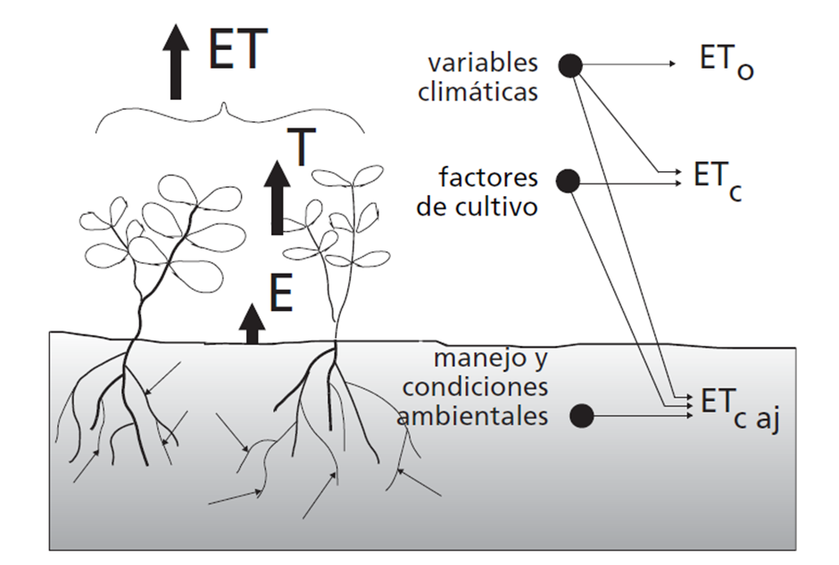
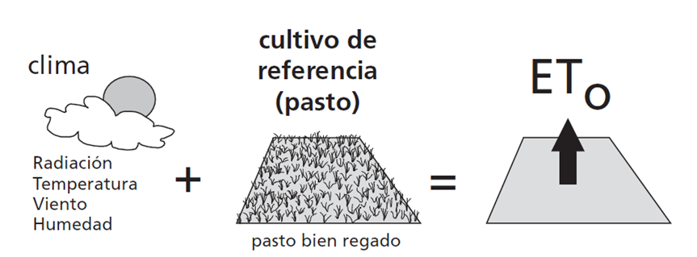
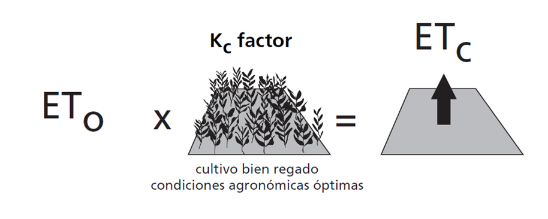
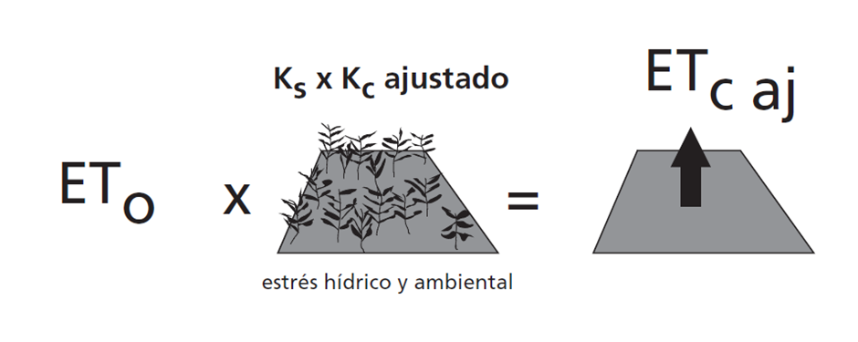
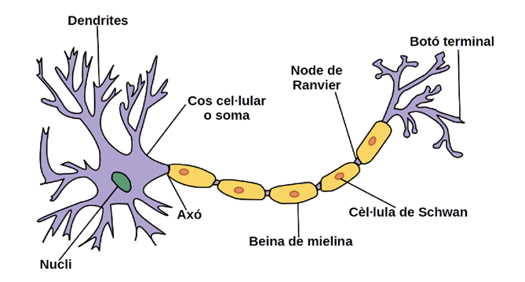

# 0. Introducción

### 1. Introducción

El actual y esperado crecimiento de la población debe ser sustentado con un incremento en la producción de alimentos. Este incremento debe derivar del desarrollo de suelo cultivable, el aumento en la intensidad de los cultivos, nuevos sistemas de cultivo, mejoras en los rendimientos y una mejor eficiencia en el uso del agua (Schults et al. 2005; Bachour et al., 2013), un recurso básico en la agricultura.

El aumento en la demanda de agua, tanto por usuarios urbanos como agrícolas, junto con las sequías y la contaminación, entre otros factores, han provocado que la disponibilidad de agua sea cada vez más escasa. Por lo tanto, se requerirá una gestión sofisticada del agua de riego para optimizar la eficiencia de su uso y así mantener niveles suficientes de productividad y calidad en los cultivos (Ortega Farias et al., 2009). Para lograr este objetivo, una estimación fiable del valor de la **evapotranspiración de referencia** puede ser de gran ayuda.

---

### 1.1 Definición de Evapotranspiración

La **evapotranspiración** se basa en dos fenómenos que ocurren al mismo tiempo:

* **Evaporación**: Es el proceso por el cual el agua líquida se convierte en vapor de agua. Este fenómeno ocurre en muchas superficies diferentes, como lagos, ríos, extensiones de tierra, vegetación que tiene agua en su superficie, etc. Para que este proceso se lleve a cabo, las moléculas de agua necesitan excitarse hasta el punto en que cambian de estado líquido a vapor. Esta excitación se produce gracias a la energía que incide en estas moléculas que, en nuestro caso, proviene, en su mayor parte, de la radiación solar y, en menor medida, de la temperatura. Además, a medida que el agua se va evaporando, el aire se va cargando de agua, lo que provoca que el proceso de evaporación sea más lento, hasta el momento en que el aire no admite más agua, punto de saturación. Así, si el aire cargado de agua no se renueva, el proceso de evaporación será más lento. El encargado, en este caso, de retirar el aire con las moléculas de agua es el viento.

Es decir, la temperatura, la radiación, la humedad atmosférica y la velocidad del viento definen la evaporación que sufrirá una superficie. En el caso de grandes superficies de tierra, otros factores también intervienen en la evapotranspiración, como la cobertura del suelo, la cantidad de agua disponible en el suelo, etc.

* **Transpiración**: La transpiración es el fenómeno que sucede cuando se vaporiza el agua líquida que contienen los tejidos de las plantas. La mayoría de las plantas pierden agua a través de los **estomas**, que son aberturas en las hojas de la planta por las cuales los gases y el vapor de agua atraviesan hacia la atmósfera. El agua que se vaporiza proviene del suelo una vez que las raíces la han absorbido, y así, pasando por la planta, termina evaporándose. La mayor parte del agua que se extrae del suelo se convierte en vapor de agua y se libera a la atmósfera, ya que solo una pequeña cantidad termina formando parte de los tejidos vegetales.

El proceso de transpiración depende también de la radiación solar, la temperatura, la presión de vapor y la velocidad del viento. Pero además, a diferencia de la evaporación, el **suelo y sus características** influyen en la transpiración. La salinidad, la textura y la capacidad de conducción de agua en el suelo, entre otros, serán aspectos que modifiquen la tasa de transpiración. Además, las características del cultivo, el medio donde se trabaja, las prácticas del cultivo y su estado de desarrollo también deben ser considerados al evaluar la transpiración.

El conjunto de estos dos procesos se denomina **evapotranspiración**. La conjunción de estos dos fenómenos ocurre simultáneamente. No es fácil distinguir entre los dos procesos, ya que dependerá de muchos factores y etapas del cultivo.

Por ejemplo, dependiendo del estado fenológico en el que se encuentre el cultivo, la cantidad de sombra que proyecta sobre el suelo variará, la radiación ya no incidirá en la misma fracción de suelo y, por lo tanto, la evaporación de agua en el suelo se verá modificada. Así, en etapas tempranas donde el cultivo no proporciona cobertura a la tierra frente a la radiación, el fenómeno con más peso será la evaporación. En cambio, en un cultivo que disponga de una gran superficie de sombreado hacia el suelo, el fenómeno prioritario dentro de la evapotranspiración será la transpiración. Debido a esto, es difícil comparar datos entre diferentes cultivos, condiciones climáticas, localidades, etc.

La evapotranspiración se expresa normalmente en **milímetros ($mm$) por unidad de tiempo**. Esta medida nos sirve para expresar la cantidad de agua perdida en la superficie de cultivo en unidades de altura de agua, ya que $mm$ de agua es igual a $L/m^2$. En cuanto al tiempo transcurrido para referenciar esta medida, puede ser de una hora, un día, semanal, mensual, etc.

Esta medida también se puede expresar en términos de la energía necesaria, **calor latente de vaporización ($\lambda$)**, para evaporar la cantidad de agua evapotranspirada. De esta manera, a una temperatura de 20ºC, $\lambda$ tiene un valor cercano a $2.45 MJ/kg$. Por lo tanto, el valor de evapotranspiración en este caso se representaría en $MJ/(m^2·día)$.

---

### 1.2 Tipos de Evapotranspiración

El concepto de evapotranspiración incluye tres definiciones diferentes que están definidas por ciertas condiciones de cada una de ellas.

#### 1.2.1 Evapotranspiración del Cultivo de Referencia ($ET_0$)

La **evapotranspiración del cultivo de referencia** es un parámetro relacionado con el clima que expresa la capacidad que tiene la atmósfera para evaporar sin restricciones de agua. Este poder de evaporación está relacionado con una superficie de referencia, que se corresponde con un cultivo hipotético de césped con ciertas características.

Este concepto nos ayuda a referenciar la capacidad de evaporación de la atmósfera independientemente del cultivo, de su manejo, o de su suelo, ya que, debido a que el agua es abundante, las condiciones del suelo y sus características no intervienen, como se ve en la Figura 2.

Así, el valor de $ET_0$ nos permite relacionar los valores de evapotranspiración a otras superficies. Además, se puede medir la capacidad de evaporación de la atmósfera en diferentes localidades, ya que la medición se puede efectuar en superficies de las mismas características en diferentes zonas. De esta manera, $ET_0$ está relacionado con parámetros climáticos. Al no considerar ni el suelo ni el cultivo para su cálculo, y su capacidad posterior para extraer valores referenciados a otros cultivos, es una buena herramienta para estimar la evapotranspiración en una localidad y época del año.

#### 1.2.2 Evapotranspiración del Cultivo bajo Condiciones Estándar ($ET_c$)

Este concepto de **evapotranspiración del cultivo bajo condiciones estándar** es la evapotranspiración que presenta cualquier cultivo sin enfermedades, con buena fertilización, en parcelas extensas, bajo condiciones de suelo y agua propicias donde se consigue la máxima producción de acuerdo con las condiciones climáticas que se presentan.

La evapotranspiración de cultivo se puede calcular a partir del valor de $ET_0$ multiplicado por un coeficiente extraído experimentalmente. Debido a la falta de información para los diferentes cultivos, no hay parámetros que se puedan relacionar directamente con una fórmula para extraerlo directamente como tal.

Así pues, la relación entre $ET_c/ET_0$ se puede extraer experimentalmente y así obtener el coeficiente, $K_c$, conocido como **coeficiente de cultivo**.

Aún así, este valor de $ET_c$ varía según propiedades aerodinámicas, albedo y otros factores, incluso estando bajo las mismas condiciones climáticas. Además, el valor de este coeficiente también variará según el estado fisiológico del cultivo, ya que en el momento de la siembra la influencia de una planta en el valor de la evapotranspiración de cultivo será diferente a cuando está en época de cosecha, donde su desarrollo vegetativo suele ser superior.

#### 1.2.3 Evapotranspiración del Cultivo bajo Condiciones No Estándar ($ET_{c,ajustada}$)

Como hemos visto anteriormente, las condiciones descritas como "estándar" difícilmente son las que se tienen en la realidad. Bajo condiciones de campo, pueden intervenir otros factores generalmente no deseados, como un elevado nivel de salinidad en el suelo, presencia de plagas y enfermedades, baja fertilidad, crecimiento de plantas no deseadas, menor densidad de plantas, etc. Estas alteraciones pueden influir en el valor de la evapotranspiración y tener valores diferentes a los que estimaríamos con $ET_c$.

Por lo tanto, la evapotranspiración del cultivo bajo condiciones no estándar, $ET_{c,ajustada}$, se calcula utilizando un **coeficiente de cultivo, $K_c$, ajustado** por diferentes condiciones de estrés y limitaciones que se presenten. Otra opción es ajustar $ET_c$ con otro coeficiente, $K_s$, que introduce el efecto de estrés hídrico que se tenga.

Actualmente, los valores de los coeficientes para ajustar la evapotranspiración y obtener $ET_{c,ajustada}$ se pueden obtener en tablas, según el cultivo y las condiciones reales que se tienen, en lugar de las estándar definidas por $ET_c$.

---

### 1.3 Estimación de la Evapotranspiración

Para determinar el valor de la evapotranspiración existen diferentes métodos: directos e indirectos. Los **métodos directos o experimentales** necesitan mediciones muy precisas con aparatos específicos, lo que normalmente conlleva un alto coste económico y es difícil de automatizar. Aun así, estas mediciones nos sirven de forma general para evaluar la eficacia de los **métodos indirectos**, que calculan la evapotranspiración de forma teórica a partir de otras variables.

#### 1.3.1 Medidas Experimentales de la Evapotranspiración

Hay diferentes métodos experimentales para calcular la evapotranspiración:

* **Balance de energía y micro-climáticos**: Son métodos que se basan en medir los diferentes flujos de energía con el principio de conservación de energía, sabiendo que la energía que llega a la superficie debe ser igual a la energía que sale de la superficie en el mismo período. De esta manera, y sabiendo que la base de la evaporación del agua es la necesidad de aportar energía, se extrae el valor de la evapotranspiración.

* **Balance de agua en el suelo**: Estos métodos miden y evalúan los flujos de agua que entran y salen de la zona radicular de un cultivo, en un período de tiempo concreto. Calculando la aportación del riego y la precipitación en un cultivo, y midiendo variables como la escorrentía y la percolación profunda, podemos saber que la diferencia entre lo aportado y lo medido al final será el agua que ha sido evaporada o ha transpirado la planta. Puede haber variables que no se puedan tener en cuenta por su dificultad para obtenerlas, como el flujo subsuperficial y la capilaridad. Aún así, los valores de evapotranspiración extraídos pueden ser medidos con cierta exactitud.

* **Lisímetros**: Este método incluye el control de las variables más difíciles de medir, debido a que se basa en aislar la zona radicular del cultivo en un volumen, donde se mide el peso con exactitud. Por lo tanto, la precisión es mucho más alta que con los métodos antes comentados. Aún así, su coste y su complejidad para tener una medida precisa limita su uso.

#### 1.3.2 Modelos Matemáticos para la Estimación de la Evapotranspiración

Debido a los impedimentos que presentan los sistemas de medición de $ET$ experimentales, se han desarrollado diferentes ecuaciones y modelos matemáticos que estiman la **evapotranspiración de referencia** a partir de parámetros climáticos que afectan directa o indirectamente a la evapotranspiración. Algunos de estos métodos necesitan ajustarse según la zona climática en la que se apliquen, o no se pueden aplicar mucho más allá de donde se calibraron.

En 1998, la FAO (Organización de las Naciones Unidas para la Alimentación y la Agricultura) estableció que la ecuación de **Penman Monteith (PM)** fuera el método estándar para el cálculo de la evapotranspiración de referencia y la validación de otros modelos (Allen, Pereira, Raes, Smith, y Ab, 1998). Pero la ecuación de Penman Monteith requiere muchos datos climáticos que no suelen estar disponibles o no son fiables en muchas estaciones, lo que limita su utilización.

Esta limitación ha evidenciado la necesidad de modelos y fórmulas que necesiten de pocos inputs climáticos, como la ecuación de **Hargreaves (Hargreaves y Samani, 1985)**, que solo necesita datos medidos de temperatura media, rango térmico y radiación extraterrestre calculada. La ecuación de Hargreaves (HG) ha sido utilizada y evaluada, dando buenos resultados y una precisión considerable en el cálculo, sobre todo si se ajusta a la zona climática donde se está aplicando. Aún así, diferentes estudios han concluido que su precisión no es recomendable para períodos de menos de cinco días, ya que se pueden producir errores en la estimación de la $ET$ diaria causados por movimientos de frentes meteorológicos y por grandes variaciones en la velocidad del viento y la cobertura de nubes (Hargreaves y Allen, 2003).

Esta ecuación es susceptible de ser calibrada y, dependiendo del clima o de la zona geográfica donde nos encontremos, es recomendable la utilización de coeficientes correctores para ajustar los resultados obtenidos, lo que no siempre conlleva una mejora en el cálculo, sobre todo para coeficientes de ajuste de períodos de tiempo extensos.

Como alternativa a los modelos convencionales, las **redes neuronales artificiales (ANN, artificial neural network)** se han aplicado con éxito para estimar la $ET$ en los últimos años.

Las ANNs son modelos simplificados inspirados en el sistema nervioso central, que actúan como procesadores distribuidos masivamente basados en simples unidades de procesamiento. Este sistema tiene la capacidad de almacenar el conocimiento experimental obtenido y así poder utilizarlo (Haykin, 1999), en este caso para el cálculo de la $ET$.

Las redes neuronales son capaces de detectar propiedades mucho más complejas en los datos de estudio que las técnicas tradicionales de estadística, debido a su estructura no lineal (Galvão et al., 1999).

---

### 1.4 Redes Neuronales Artificiales

#### 1.4.1 Nociones de ANNs

El funcionamiento neuronal biológico consiste en una red donde millones de neuronas están interconectadas. En la Figura 5 se representa una neurona y sus partes. El sistema artificial pretende recrear el sistema biológico.

Las redes neuronales artificiales están formadas por un número determinado de procesadores, o neuronas, dispuestos en varias capas e interconectados entre sí mediante conexiones a las que se les asigna un factor de ponderación o peso. De esta manera, realizan cálculos simples basados en la información que reciben de las neuronas, o procesadores vecinos. Una de las características de las redes neuronales es que no siguen unas reglas escritas, sino que se basan en aprender, donde los pesos de las conexiones que se han asignado aleatoriamente al principio se van ajustando progresiva y automáticamente para poder resolver el problema en cuestión.

Así, las redes neuronales artificiales se basan en adquirir conocimiento gracias a un entorno y a la capacidad de aprendizaje, ajustando la fuerza o peso de las conexiones de las neuronas entre sí. Así, una red neuronal se verá estimulada por el entorno, estos estímulos harán cambiar los pesos de las conexiones de las neuronas, y es cuando la red neuronal se comportará de manera diferente a como lo hacía, ya que habrá adquirido conocimiento, cambiando sus parámetros internos.

Para ello habrá que establecer una arquitectura neuronal. La arquitectura neuronal comprende el número de neuronas y capas ocultas que se definirán para luego "entrenar" la red o modelo con datos de entrenamiento o aprendizaje. Estos datos de aprendizaje deberán ser representativos y significativos.

#### 1.4.2 Evolución de las ANNs

En 1943, se produjo el primer intento para explicar el funcionamiento del cerebro humano (McCulloch y Pitts), como una red de células interconectadas entre sí. No fue hasta 1949 cuando se propuso que estas redes artificiales eran capaces de aprender, ya que este hecho estaba relacionado con la conductividad de la sinapsis. Cuando una neurona era activada repetidamente por otra a través de una sinapsis determinada, aumentaba su conductividad, hecho que acababa induciendo a la formación de un circuito de neuronas estrechamente conectadas entre sí (Hebb, 1949).

En 1951 se creó la primera máquina de redes neuronales, con 40 neuronas, que imitaba el cerebro de una rata. Más tarde, se presentó "Perceptron", que presentaba tres tipos de unidades: sensores, unidades de asociación y unidades de respuesta. El "Perceptron" es la red neuronal más antigua con capacidad de generalizar después de haber pasado por un proceso de aprendizaje.

Dos años más tarde, se crea "Adaline", la primera red neuronal para solucionar un problema real, como era la aplicación de filtros adaptativos para eliminar ecos en las líneas telefónicas.

Más tarde, una nueva técnica de aprendizaje, denominada **retropropagación del error**, impulsó aún más su utilización hasta la actualidad, donde sus aplicaciones se han introducido en diferentes campos.

#### 1.4.3 Aplicaciones de Redes Neuronales en Diferentes Campos

Hoy en día es amplia la bibliografía que presenta resultados de redes neuronales aplicadas a diferentes ámbitos como finanzas (para detección de fraudes, interpretación de firmas), medicina (con análisis de imágenes, causalidad de ataques epilépticos), en el transporte (útil para la optimización de rutas, distribución de recursos) y en muchos más ámbitos. La razón para su aplicación en múltiples situaciones es la capacidad para reconocer patrones no lineales, como ya habíamos comentado anteriormente, lo que convierte a las redes neuronales en una herramienta versátil.

En el ámbito de la agricultura, son numerosos los estudios aplicados de redes neuronales, por ejemplo:
* Análisis de imágenes de productos agrícolas mediante redes neuronales (D.D. Jayas, J. Paliwal, N.S. Visen 2004). Debido a que la forma de los productos agrícolas no está gobernada por ninguna función matemática, el uso de redes neuronales puede ser funcional para analizar imágenes de estos y clasificarlos.
* Predicción del rendimiento de cultivo (Snehal S. Dahikar, Sandeep V. Rode, 2004).
* Estimación de contenido hídrico del suelo (Martí et al., 2012).
* Estimación de precipitación a partir de imágenes satélite (Islam e Kothari, 2000).
* Diseño hidráulico de riego (Shayya and Sablani 1998, Martí et al., 2010b).

#### 1.4.4 Utilización de ANNs en el Cálculo de $ET$

En la actualidad, hay muchos estudios sobre la estimación de la $ET$ (Sudheer et al. 2003; Kumar et al. 2008; Landeras et al. 2008; Kisi 2007; Kisi Ö and Cimen 2009), pero por su similitud con el estudio, se destacan solo los siguientes:
* **Zanetti et al. (2007)**: Utilizaron redes neuronales para estimar los valores de evapotranspiración de referencia calculados con la ecuación de la FAO-56 PM, a partir de valores máximos y mínimos de temperatura, radiación extraterrestre y horas de luz diarias.
* **Martí y Gasque (2010)**: Utilizaron modelos de redes neuronales para el cálculo de la evapotranspiración considerando inputs locales e inputs auxiliares exógenos de estaciones vecinas, incorporando también la evaluación externa de los modelos entrenados.
* **Marti et. al. (2011)**: Este estudio analiza la capacidad de un modelo neuronal entrenado con temperatura máxima, mínima, radiación extraterrestre teórica y horas de luz diarias. Este estudio considera por primera vez un proceso de evaluación robusto en modelos de $ET$, la evaluación por partes. Así, se repite el procedimiento entrenamiento-test hasta evaluar el set de datos al completo.

---

### 1.5 Objetivos del Trabajo

Este estudio presenta los siguientes objetivos:
* Implementar diferentes modelos neuronales para estimar la evapotranspiración de referencia en las Islas Baleares.
* Proponer modelos neuronales artificiales basados en pocas variables de entrada como alternativa a los modelos convencionales existentes.
* Aplicar un procedimiento robusto de validación de los modelos, la validación por partes, como alternativa al método hold-out, habitual en la práctica.
* Aplicar Matlab para llevar a cabo todos los procedimientos estudiados.