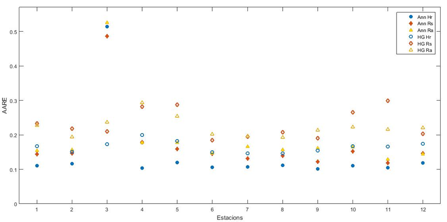
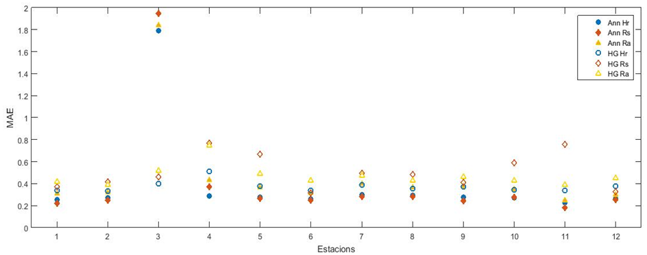

### 1. Resultados
---

#### 1.1 Resultados Globales

La **Tabla 7** presenta los indicadores globales promedio de los modelos, con dos criterios de selección de arquitectura óptima, así como los modelos empíricos correspondientes, tanto calibrados como sin calibrar. Estos indicadores son la media de los errores de cada año de prueba para todas las estaciones, excluyendo la estación 3 (Ciutadella). La estación de Ciutadella fue excluida porque sus 240 días de datos, mucho menos que en otras estaciones, sesgaban los resultados globales. La escasez de datos hace que las muestras de entrenamiento y prueba no sean representativas, por lo que un enfoque como el método "leave-one-out" sería más adecuado para esta estación.

**Tabla 7: Resultados globales de los modelos neuronales y empíricos**

| Modelo | MSE | RRMSE | MAE | R2 | AARE |
|---|---|---|---|---|---|
| **Validación** | | | | | |
| AnnRs | 0.356 | 0.120 | 0.277 | 0.958 | 0.151 |
| AnnRa | 0.493 | 0.166 | 0.357 | 0.919 | 0.164 |
| AnnHr | 0.401 | 0.136 | 0.282 | 0.946 | 0.115 |
| **Prueba** | | | | | |
| AnnRs | 0.339 | 0.114 | 0.261 | 0.961 | 0.144 |
| AnnRa | 0.476 | 0.160 | 0.344 | 0.923 | 0.158 |
| AnnHr | 0.385 | 0.130 | 0.271 | 0.950 | 0.110 |
| **Sin Ajustar** | | | | | |
| Empírico (Hargreaves) | 0.338 | 0.196 | 0.485 | 0.949 | 0.228 |
| Empírico (Hargreaves y Samani) | 0.693 | 0.280 | 0.672 | 0.889 | 0.326 |
| Empírico (Valiantzas) | 0.381 | 0.204 | 0.461 | 0.924 | 0.211 |
| **Ajustados** | | | | | |
| Empírico (Hargreaves) | 0.398 | 0.205 | 0.506 | 0.949 | 0.231 |
| Empírico (Hargreaves y Samani) | 0.378 | 0.202 | 0.468 | 0.889 | 0.222 |
| Empírico (Valiantzas) | 0.250 | 0.166 | 0.373 | 0.924 | 0.165 |

**Análisis de los Resultados Globales:**
- La diferencia entre los dos criterios de selección de arquitectura óptima (validación y prueba) es mínima, con una ligera mejora en el criterio de prueba.
- El coeficiente de determinación ($R^2$) es alto en todos los modelos, lo que indica una **alta correlación lineal** con el modelo PM-56.
- El modelo con el mayor error es el que utiliza la radiación extraterrestre como input. Esto sugiere que la radiación solar y la humedad relativa tienen una mayor influencia en la evapotranspiración en las Islas Baleares que la radiación extraterrestre, que es una variable calculada y no medida.
- Al comparar los modelos que utilizan radiación solar y humedad relativa, los resultados varían según el indicador. El modelo con humedad relativa tiene un **menor error relativo** (AARE), mientras que el modelo con radiación solar tiene **menores errores absolutos** (MSE, RRMSE, MAE). Esto sugiere que la elección del mejor modelo depende del indicador de rendimiento que se priorice.
- Los **modelos de redes neuronales superan consistentemente** a sus equivalentes empíricos, tanto calibrados como sin calibrar.
- El ajuste de los modelos empíricos con un solo factor de corrección anual (AHC) no siempre mejora el rendimiento, lo que resalta la limitación de este método y sugiere que se necesitarían coeficientes de ajuste para periodos de tiempo más cortos, como mensuales, para obtener mejores resultados.

---
#### 1.2 Resultados por Estación

Las **Figuras 14 y 15**  muestran los valores de AARE y MAE por estación, respectivamente, según el criterio de prueba. Los gráficos confirman que los errores de los modelos neuronales (símbolos sólidos) son menores que los de los modelos empíricos en todas las estaciones, excepto en la estación 3, debido a su limitado conjunto de datos.

- El modelo neuronal que mejor rinde en casi todas las estaciones es el que utiliza la humedad relativa.
- Se observa que la diferencia de rendimiento entre los modelos que usan radiación solar y radiación extraterrestre es mínima en estaciones como **Eivissa S'estany (4)**, **Felanitx (6)** y **Son Ferriol (12)**. Esto indica que en estas estaciones, la temperatura sola podría ser suficiente para estimar la evapotranspiración, lo que contradice la tendencia general observada en los resultados globales.
- La tendencia de los errores absolutos (MAE) es constante: los modelos con el menor error son los que usan humedad relativa, seguidos por los de radiación solar y, finalmente, los de radiación extraterrestre.

**Figura 14.** Figura 14: Indicador AARE dels diferents models per estacions – Adimensional (-)

**Figura 15.** Figura 15: Indicador MAE dels  diferents models per estacións – (mm/dia)

---
#### 1.3 Resultados por Año de Prueba

La **Figura 16** (no proporcionada, pero se describe) muestra los errores RRMSE de los modelos neuronales en la estación 1 para cada año de prueba. Se observa que el modelo que generalmente tiene los errores más bajos es el que utiliza radiación solar. Los modelos de radiación extraterrestre y humedad relativa obtienen resultados variables, con errores significativamente más bajos en los años de prueba 1 y 13.

- Estas variaciones anuales evidencian la importancia de la técnica de **validación cruzada (k-fold)**, ya que un enfoque "hold-out" (que usa un solo conjunto de prueba) podría llevar a conclusiones sesgadas o solo parcialmente válidas, como al comparar los resultados del año 1 con los del año 2.
- La **Figura 17** (no proporcionada, pero se describe) muestra los errores RRMSE para la estación 3. El error es mucho más alto en el segundo año de prueba, lo que demuestra que un solo año de datos puede no ser representativo. Este elevado error es la principal razón por la que se decidió excluir la estación 3 del análisis global.

---
#### 1.4 Selección de la Arquitectura Óptima

La **Tabla 8** muestra el número promedio de neuronas seleccionadas para cada modelo, según los criterios de validación y prueba.

**Tabla 8: Número de neuronas de los diferentes modelos neuronales según los dos criterios de selección de arquitectura óptima**

| Estación | Modelo: Rs, Tmitja | Modelo: Tmax, Tmin, Tmitja, Ra | Modelo: Tmax, Tmin, Tmitja, Ra, HR mitja |
|---|---|---|---|
| | **CV** | **Prueba** | **CV** | **Prueba** | **CV** | **Prueba** |
| 1 | 7.15 | 5.23 | 7.08 | 5.92 | 9.62 | 5.77 |
| 2 | 6.46 | 6.46 | 6.77 | 5.00 | 8.15 | 6.54 |
| 3 | 5.50 | 8.00 | 6.00 | 6.50 | 6.50 | 5.00 |
| 4 | 6.62 | 6.23 | 5.62 | 6.15 | 9.31 | 4.77 |
| 5 | 8.31 | 6.38 | 8.85 | 6.08 | 8.54 | 4.54 |
| 6 | 6.23 | 5.08 | 7.54 | 5.54 | 8.69 | 3.69 |
| 7 | 8.08 | 5.85 | 8.38 | 5.08 | 8.69 | 5.62 |
| 8 | 6.85 | 5.69 | 7.85 | 4.69 | 7.38 | 5.92 |
| 9 | 8.23 | 6.38 | 8.69 | 6.23 | 8.38 | 5.00 |
| 10 | 8.46 | 6.38 | 7.85 | 6.23 | 9.31 | 4.77 |
| 11 | 9.11 | 5.89 | 7.56 | 4.11 | 8.33 | 5.67 |
| 12 | 6.00 | 4.08 | 7.62 | 5.77 | 8.85 | 4.77 |
| **Media** | 7.25 | 5.97 | 7.48 | 5.61 | 8.48 | 5.17 |

- En general, las arquitecturas seleccionadas por el criterio de validación tienen **más neuronas** que las seleccionadas por el criterio de prueba. Esto contradice la idea teórica de que menos neuronas mejoran la capacidad de generalización. No obstante, esto podría deberse a que el número máximo de neuronas (10) considerado en el estudio no fue suficiente para validar esa relación.
- La **Figura 18** (no proporcionada, pero se describe) ilustra el proceso de selección de la arquitectura óptima. El gráfico muestra tres curvas de error: entrenamiento, validación y prueba. El proceso consiste en elegir la arquitectura con el menor error de validación, y luego se evalúan los resultados de esa arquitectura utilizando el conjunto de datos de prueba.